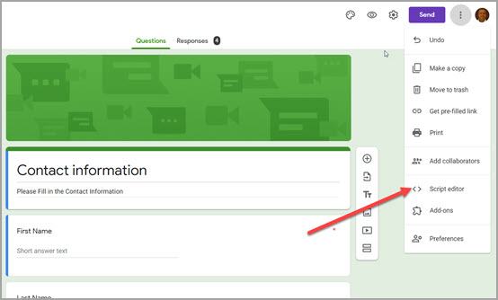
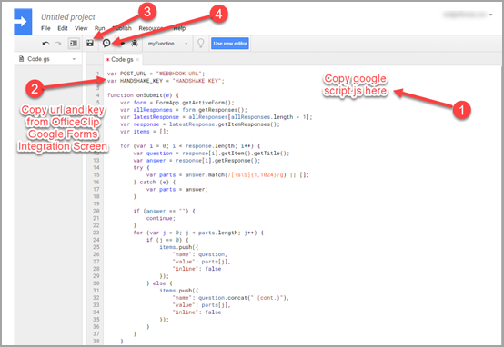
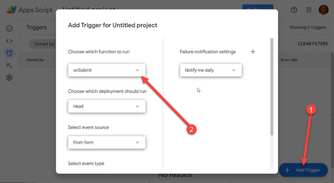

# Basic Setup

1) Create a [Google Form](https://docs.google.com/forms/u/0/) for use with this script
2) Make the form however you'd like.

3) Go to the Script editor.

4) Paste the contents of `google script.js`.

5) Go to the OfficeClip Integration App and Select Google Forms and click on Install.

6) Copy the Webhook URL. Replace `WEBHOOKURL` at the top of the script with the URL you copied.

7) Add a trigger by selecting Current project's triggers in the Edit menu, and creating a new trigger using the settings given below.

8) Submit a test response to make sure it works.

